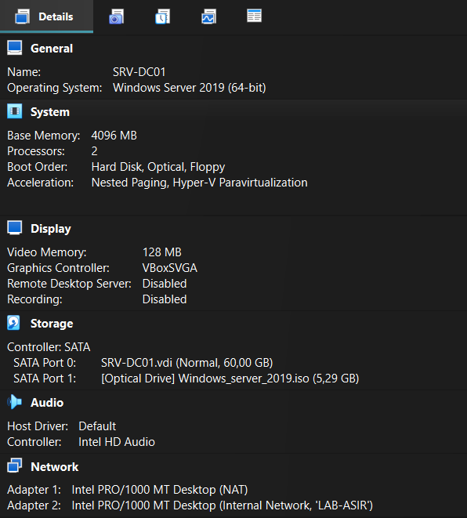
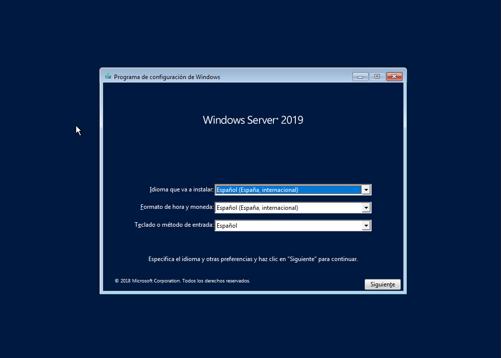
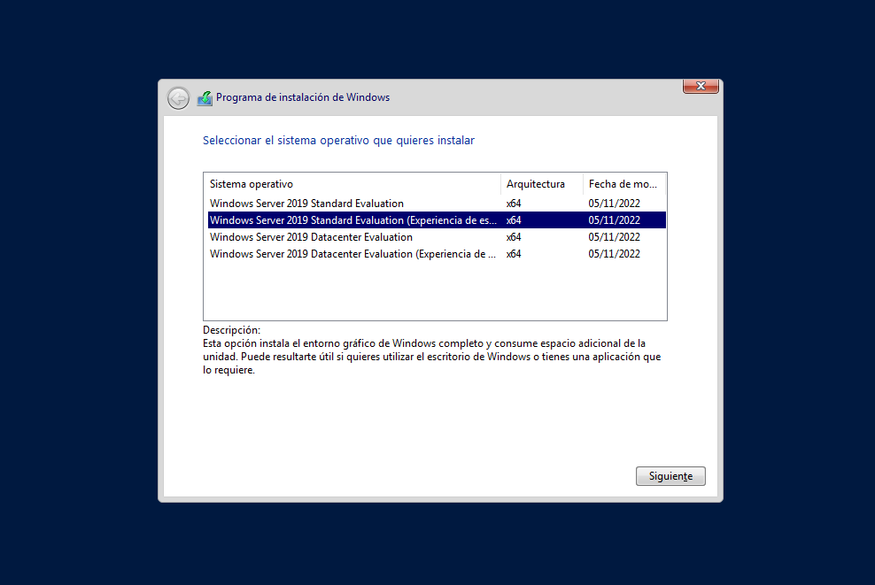
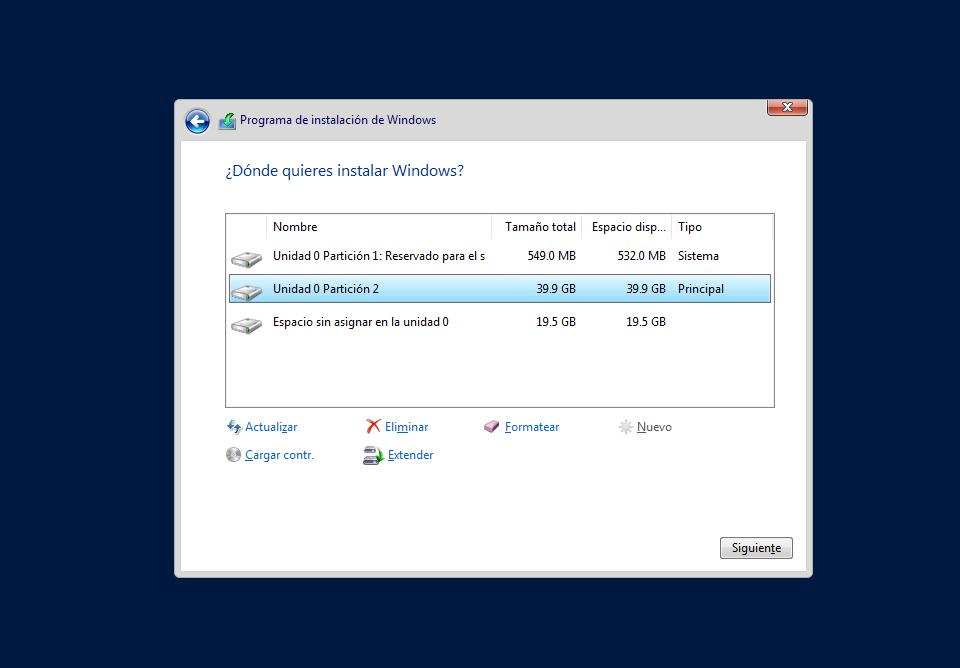
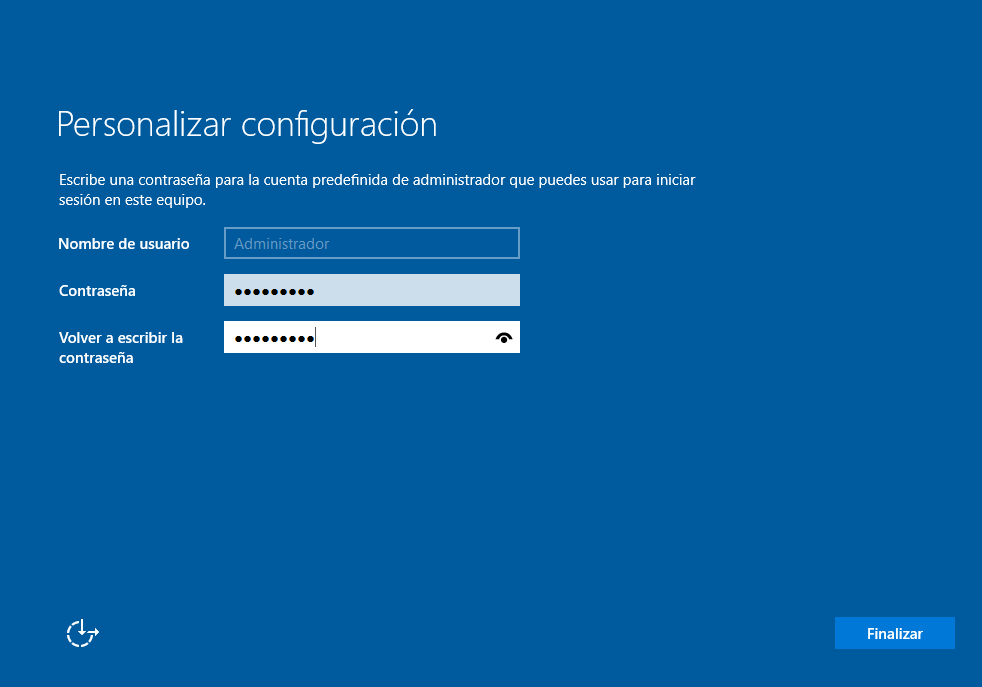
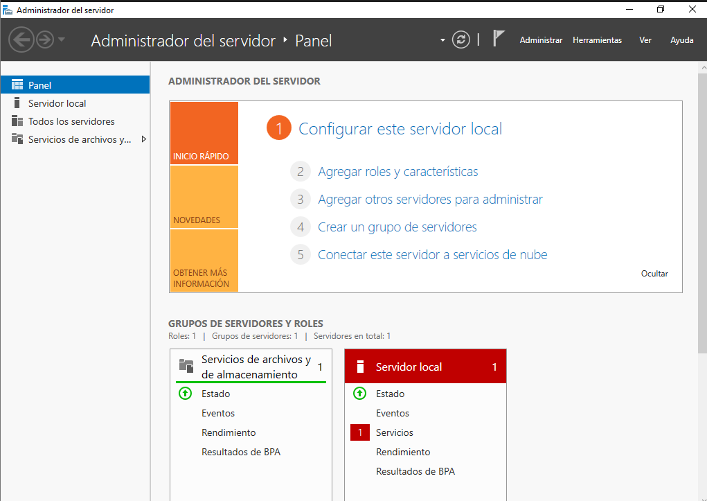
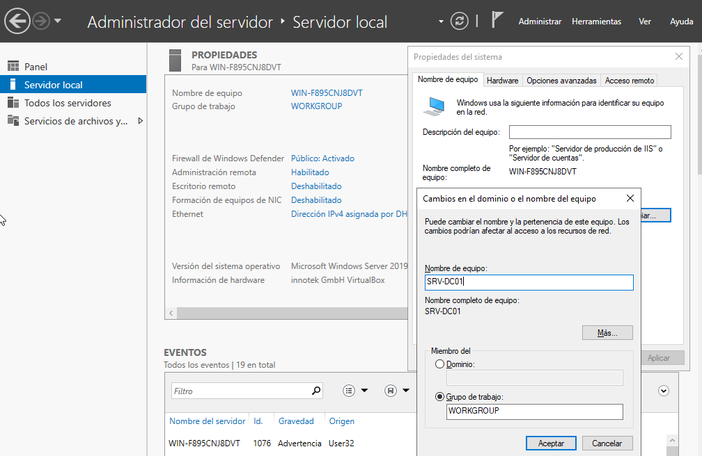
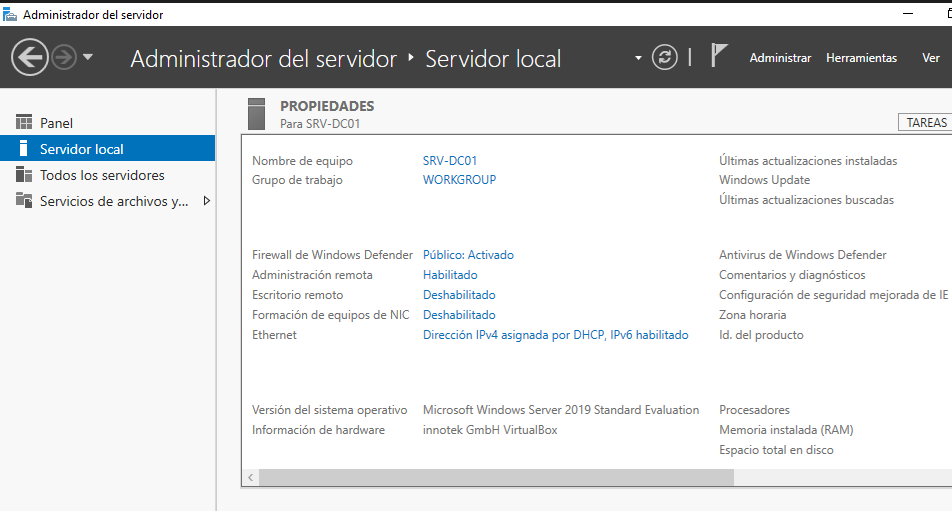
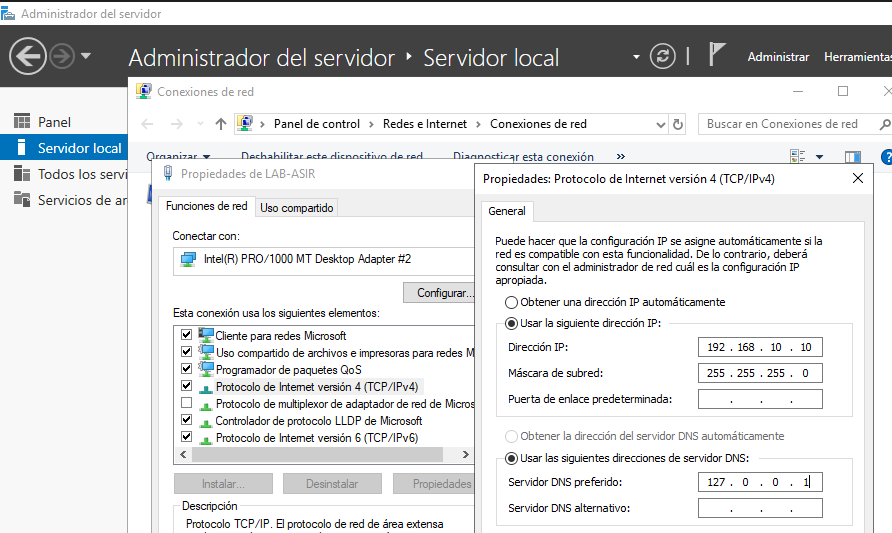
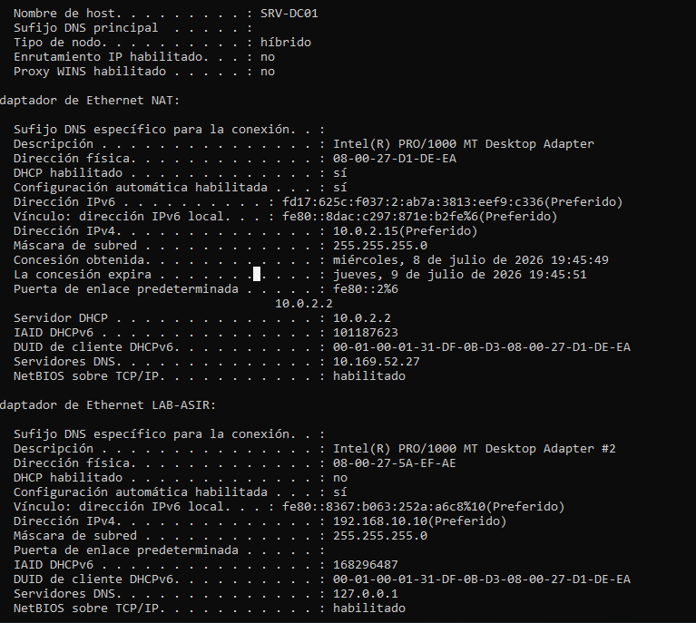

# Windows Server Installation

## Overview

This section documents the installation and initial configuration of a Windows Server 2019 virtual machine.

The server is prepared to be used as the foundation of a complete Active Directory lab, including DNS, DHCP, Group Policy, File Services and domain management.

## Virtual Machine Specifications

| Component | Value |
|-----------|-------|
| Hypervisor | VirtualBox 7.2.6 |
| Operating System | Windows Server 2019 (Desktop Experience) |
| RAM | 4096 MB |
| CPU | 2 CPU |
| Disk | 60 GB |

## VirtualBox Settings

The virtual machine was created in Oracle VirtualBox using the following configuration:

- Windows Server 2019 Standard (Desktop Experience)
- 4 GB RAM
- 2 vCPUs
- 60 GB dynamically allocated virtual disk
- Network Adapters:
    - NAT adapter for Internet connectivity
    - Internal network adapter (`LAB-ASIR`) for the lab environment

## Language Selection

Select the installation language, time zone and keyboard layout before starting the installation. 

## Windows Server Edition

Select **Windows Server 2019 Standard (Desktop Experience)**.

This version includes a Graphical User Interface (GUI), making it easier to learn Windows Server administration for beginners.

## Disk Configuration

Select the unallocated disk space and let Windows automatically create the required system partitions.

## Administrator Password

Set a strong administrator password that meets the Windows Server requirements.

## First Login

After the installation, Windows Server starts for the first time and automatically opens Server Manager, which is the main administration console.

## Rename the Server

The default computer name was changed to `SRV-DC01` following a common server naming convention.

## Configure a Static IP Address

The internal network adapter was configured with a static IPv4 address to ensure reliable communication with future domain clients.

## Verify Network Configuration

The network configuration was verified using the `ipconfig /all` command to confirm the correct IP address and adapter settings.

## Result

The Windows Server installation was completed successfully and the virtual machine was prepared for future Active Directory deployment.

The server includes:

- Computer name: `SRV-DC01`
- Static IPv4 configuration
- Two network adapters (NAT and `LAB-ASIR`)
- Windows Server 2019 Standard (Desktop Experience)

The environment is now ready for the next lab: Active Directory Domain Services (AD DS).

## Lessons Learned

- Install and configure Windows Server 2019 in VirtualBox.
- Configure a static IP address for a server.
- Rename the server following common naming conventions.
- Understand the relationship between Active Directory and DNS.
- Prepare a Windows Server for Active Directory deployment.

The server is ready to be promoted to a Domain Controller and continue with the Active Directory deployment.