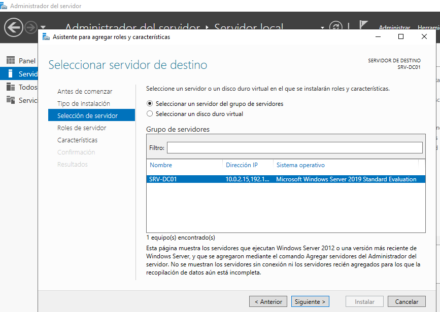
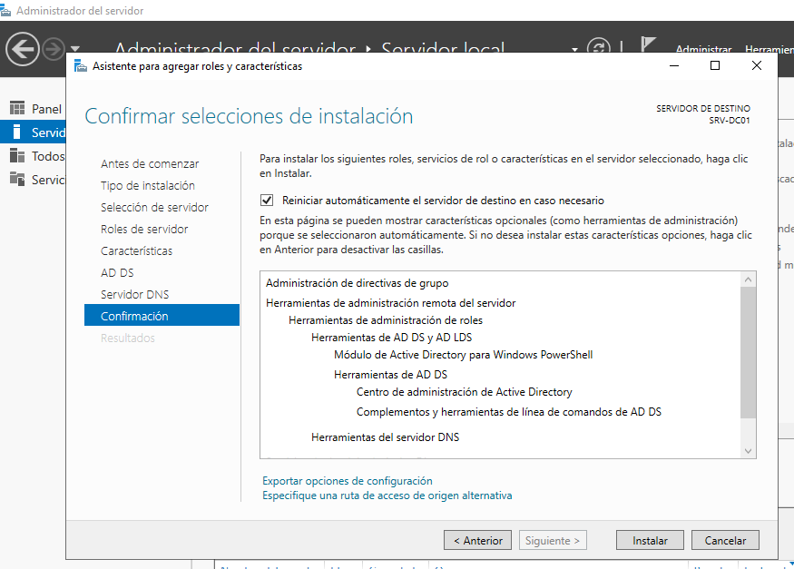
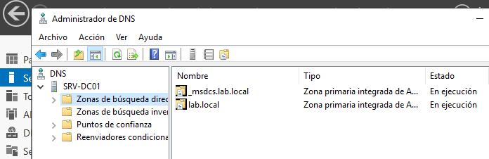
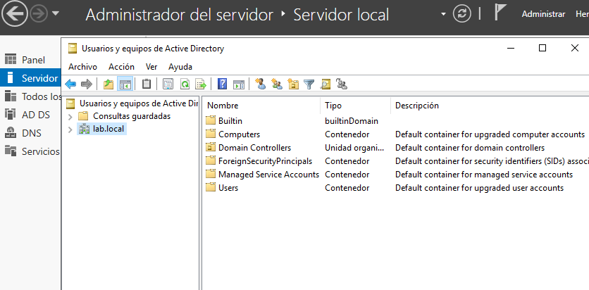

# Active Directory

## Overview

This section documents the deployment of Active Directory Domain Services (AD DS) on Windows Server 2019.

The server is promoted to a Domain Controller and configured as the first server of the `lab.local` domain.

## Lab Objectives

- Install the Active Directory Domain Services (AD DS) role.
- Install and configure the DNS Server role.
- Promote the server to a Domain Controller.
- Create a new Active Directory forest named `lab.local`.

## Environment

This lab was performed on the Windows Server 2019 virtual machine created in the previous section.

The server was configured as the first Domain Controller of the `lab.local` domain.

## Installation of Active Directory and DNS

The Active Directory Domain Services role was installed using Server Manager.

During the installation, Windows automatically added the required management tools and the DNS Server role.

## Create a New Forest

A new Active Directory forest named `lab.local` was created during the promotion of the server to a Domain Controller.

After the installation was completed, the domain became available for administration.

## Configure DNS

The DNS Server role was configured together with Active Directory.
DNS is responsible for resolving domain names, allowing clients to locate the Domain Controller and other network services.

## Verification

The Active Directory Users and Computers console confirms that the `lab.local` domain was successfully created.

## Results

The server was successfully promoted to a Domain Controller.

The `lab.local` forest was created, and both Active Directory and DNS were configured correctly.

The environment is now ready for user management, Group Policy, DHCP and additional Windows Server services.

## Lessons Learned

- Install the Active Directory Domain Services role.
- Understand the relationship between AD DS and DNS.
- Promote a Windows Server to a Domain Controller.
- Create a new Active Directory forest.
- Verify a successful domain deployment using administrative tools.