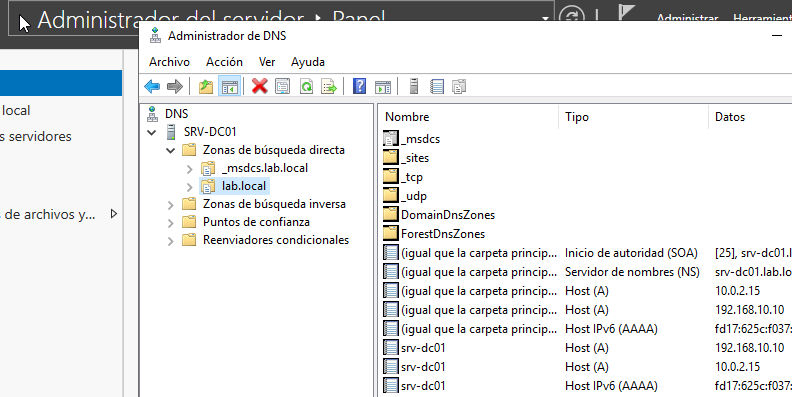
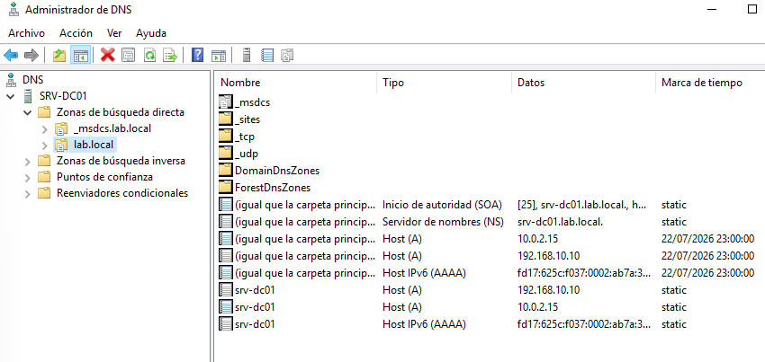
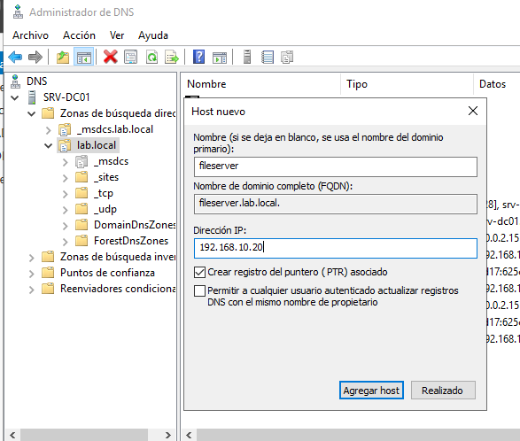
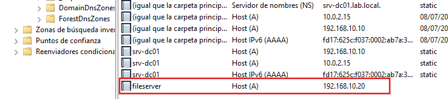
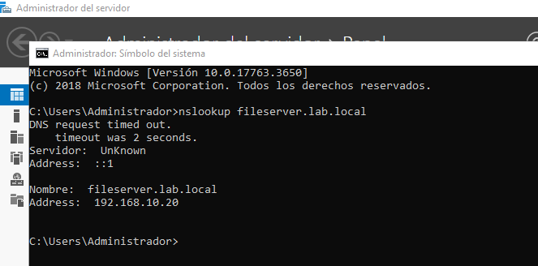
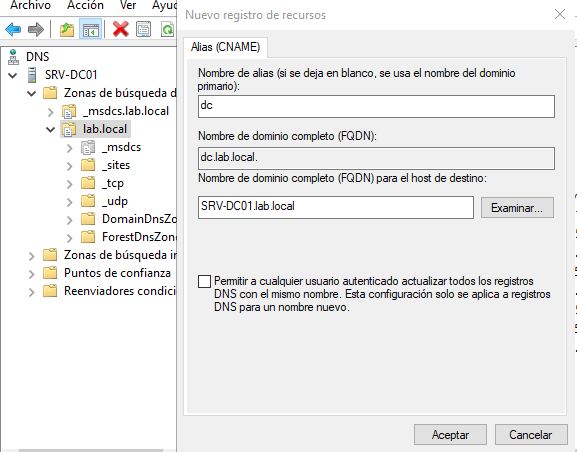
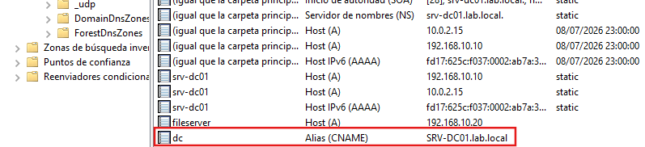
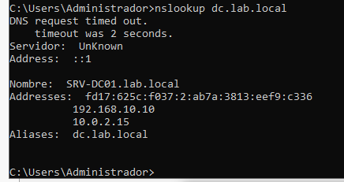

# DNS Server

## Overview

This section documents the configuration of the DNS Server role in the Windows Server 2019 lab.

The DNS service is required for Active Directory and allows clients to locate domain controllers and other network resources.

## Lab Objectives

- Understand the purpose of DNS in an Active Directory environment.
- Explore the DNS Manager console.
- Verify the DNS zones created during the Active Directory installation.
- Create and manage DNS records.
- Test name resolution.

## Environment

| Component | Value |
|----------|-------|
| Server | SRV-DC01 |
| Operating System | Windows Server 2019 |
| Domain | `lab.local` |
| Role | DNS Server |

## DNS Zones

Open **Server Manager → Tools → DNS** and expand **Forward Lookup Zones**.

The DNS Manager displays the primary zones created automatically during the Active Directory installation: `_msdcs.lab.local` and `lab.local`.

## Default DNS Records

The `lab.local` DNS zone contains the default records created during the Active Directory installation.

These records allow clients to locate the Domain Controller and other network services.

## Creating a Host (A) Record

A new Host (A) record named `fileserver` was created and assigned the IP address `192.168.10.20`.

## Testing Name Resolution

The `nslookup` command was used to verify that the DNS record resolves to the expected IP address.

## Creating a CNAME Record

CNAME (Canonical Name) is an alias for server `SRV-DC01.lab.local`.

A CNAME record was created to provide an alias for `SRV-DC01.lab.local`.

Clients can now use `dc.lab.local` to reach the same server.

## Verifying the Alias

The `nslookup` command confirms that the alias resolves to the same server.

## Results

The DNS Server was successfully configured as part of the Active Directory environment.

The default DNS zones were verified, and both Host (A) and CNAME records were created successfully.

Name resolution was tested using `nslookup`, confirming that the DNS service is working correctly.

## Lessons Learned

- Understand the role of DNS in an Active Directory environment.
- Explore the default DNS zones created by AD DS.
- Create and manage Host (A) records.
- Create CNAME aliases.
- Verify DNS name resolution using `nslookup`.