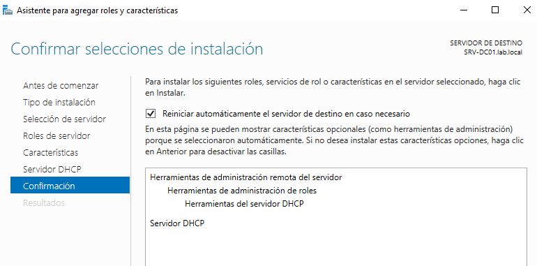
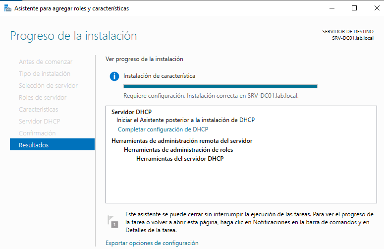
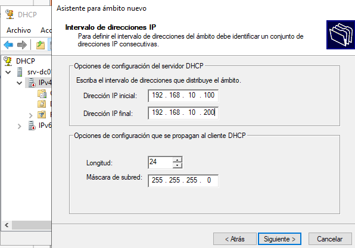
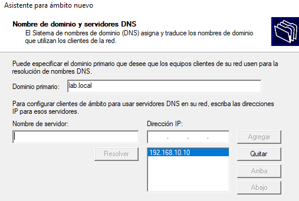
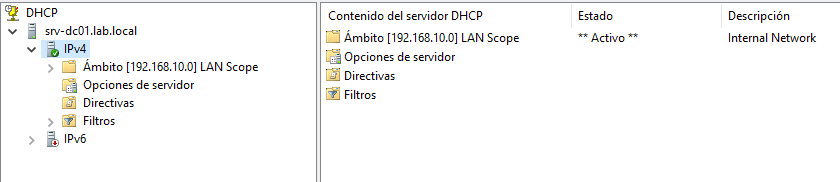
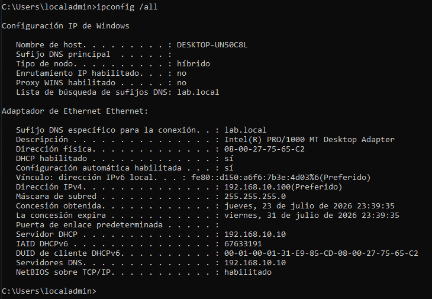

# DHCP Server

## Overview

This section documents the installation and configuration of the DHCP Server role in the Windows Server 2019 lab.

DHCP automatically assigns network settings to client computers, reducing manual configuration and preventing IP address conflicts.

## Lab Objectives

- Install the DHCP Server role.
- Create and configure a DHCP scope.
- Configure DNS settings for DHCP clients.
- Authorize the DHCP server in Active Directory.
- Verify automatic IP address assignment from a Windows 10 client.

## Environment

| Component | Value |
|----------|-------|
| Server | SRV-DC01 |
| Operating System | Windows Server 2019 |
| Domain | `lab.local` |
| DHCP Scope | `192.168.10.100 - 192.168.10.200` |
| Subnet Mask | `255.255.255.0` |

## Installing the DHCP Server Role

The DHCP Server role was installed using Server Manager.

After the installation, the DHCP post-installation configuration was completed to authorize the server in Active Directory.

## Creating a DHCP Scope

A new IPv4 scope was created to automatically assign IP addresses to client computers.

The scope uses the following range:

- Start IP: `192.168.10.100`
- End IP: `192.168.10.200`
- Subnet Mask: `255.255.255.0`

## Configuring DNS

The DHCP scope was configured to provide the following DNS information to clients:

- Domain: `lab.local`
- Preferred DNS Server: `192.168.10.10`

## DHCP Scope Verification

After completing the configuration, the DHCP scope was activated and became available to assign IP addresses.

## Client Verification

The Windows 10 client was configured to obtain its network settings automatically.

After renewing the DHCP lease, the client successfully received:

- An IPv4 address from the configured scope.
- The correct subnet mask.
- The DNS server address.
- The DHCP server address.

The configuration was verified using the `ipconfig /all` command.

## Results

The DHCP Server was successfully deployed and integrated into the Active Directory environment.

Windows 10 clients automatically receive valid network settings without requiring manual configuration.

## Lessons Learned

- Install and configure the DHCP Server role.
- Create and manage IPv4 scopes.
- Configure DHCP options for DNS.
- Authorize a DHCP Server in Active Directory.
- Verify DHCP leases using `ipconfig /all`.