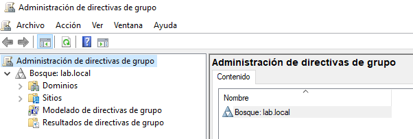
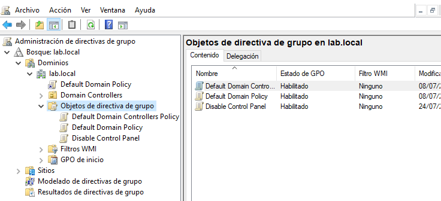
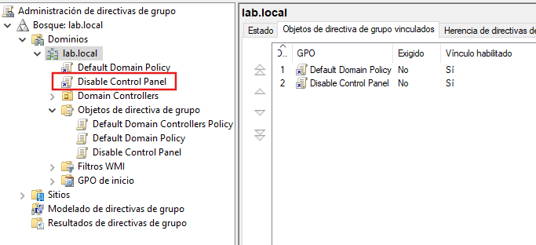
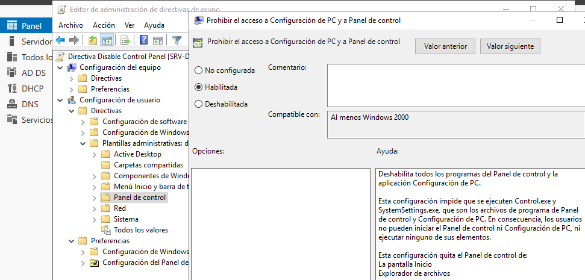
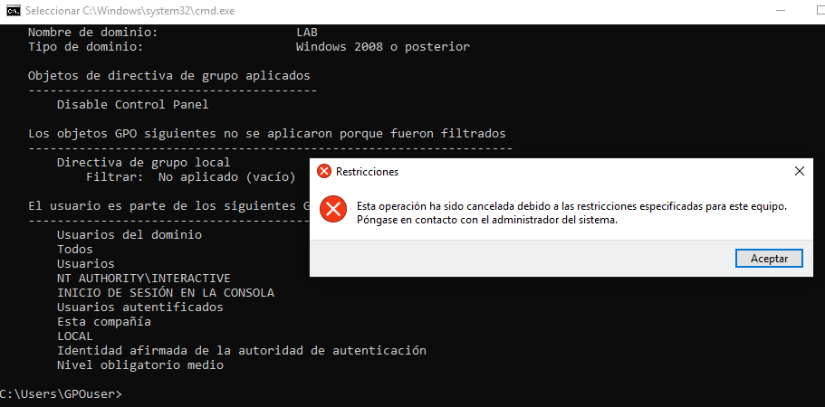

# Group Policy

## Overview

This section documents the creation and deployment of a Group Policy Object (GPO) in an Active Directory environment.

Group Policy allows administrators to centrally manage and enforce security and configuration settings across domain users and computers.

---

## Lab Objectives

- Create a new Group Policy Object (GPO).
- Link the GPO to the domain.
- Configure a user policy.
- Apply the policy to a domain user.
- Verify that the policy is enforced on the client computer.

---

## Environment

| Component | Value |
|----------|-------|
| Server | SRV-DC01 |
| Client | PC-01 |
| Operating System | Windows Server 2019 / Windows 10 |
| Domain | `lab.local` |
| Test User | `GPOuser` |

---

## Opening Group Policy Management

The Group Policy Management Console (GPMC) was used to create and manage domain policies.

---

## Creating the GPO

A new Group Policy Object named **Disable Control Panel** was created.

---

## Linking the GPO

The policy was linked to the `lab.local` domain so it could be applied to domain users.

---

## Configuring the Policy

The following policy was enabled:

**User Configuration → Policies → Administrative Templates → Control Panel → Prohibit access to Control Panel and PC settings**

This setting prevents users from opening the Control Panel and Windows Settings.

---

## Client Verification

A domain user (`GPOuser`) signed in to the Windows 10 client.

When attempting to open the Control Panel, access was denied, confirming that the Group Policy had been successfully applied.

---

## Results

The Group Policy was successfully deployed and applied through Active Directory.

The client received the policy after joining the domain, demonstrating centralized management of user settings.

---

## Lessons Learned

- Create and manage Group Policy Objects.
- Link GPOs to an Active Directory domain.
- Configure user-based administrative policies.
- Verify Group Policy deployment on a client computer.
- Understand how Active Directory centralizes system administration.