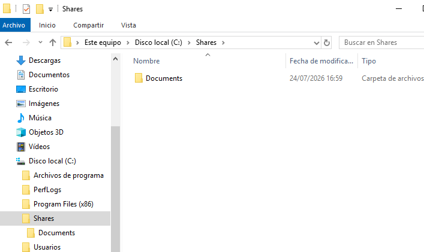
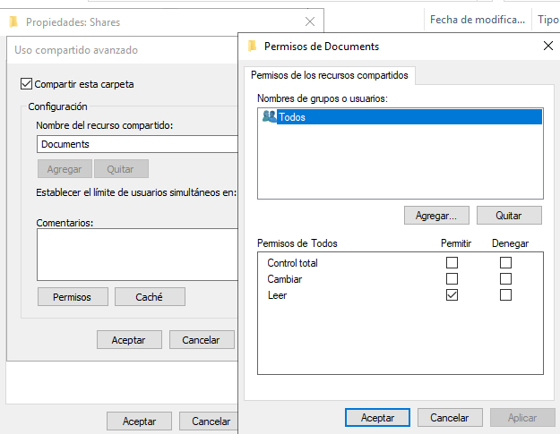
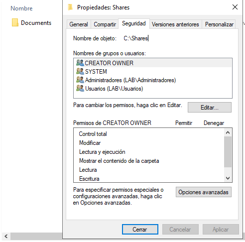
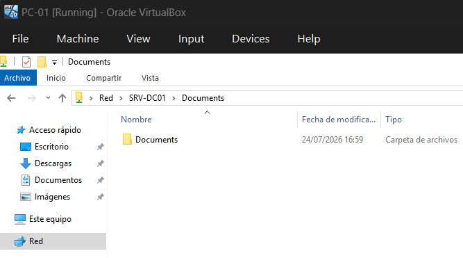
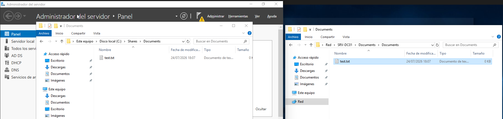

# File Server

## Overview

This section documents the configuration of a shared folder on Windows Server 2019.

The shared folder allows domain users to access files over the network while demonstrating the relationship between Share Permissions and NTFS permissions.


## Lab Objectives

- Create a shared folder.
- Configure Share Permissions.
- Review NTFS permissions.
- Access the shared folder from a Windows 10 client.
- Verify file sharing across the network.


## Environment

| Component | Value |
|----------|-------|
| Server | SRV-DC01 |
| Client | PC-01 |
| Operating System | Windows Server 2019 / Windows 10 |
| Domain | `lab.local` |
| Shared Folder | `\\SRV-DC01\Documents` |


## Creating the Shared Folder

A folder named **Documents** was created inside `C:\Shares` to store shared files.




## Configuring Share Permissions

The folder was shared using **Advanced Sharing**.

For this laboratory, the **Everyone** group was temporarily granted **Change** permissions to verify file creation from the client computer.

> **Note:** In a production environment, permissions should be assigned to specific Active Directory groups instead of the **Everyone** group.




## NTFS Permissions

The folder permissions were reviewed using the **Security** tab.

NTFS permissions provide access control for both local and network users.




## Accessing the Shared Folder

The Windows 10 client successfully accessed the shared folder using the UNC path:

```text
\\SRV-DC01\Documents
```




## File Sharing Verification

A test file was created from the client computer and successfully appeared inside the shared folder on the server.

This confirmed that file sharing and permissions were working correctly.




## Results

The shared folder was successfully deployed and tested.

Clients connected to the domain were able to access the shared resource through the network.


## Lessons Learned

- Configure shared folders in Windows Server.
- Understand the difference between Share Permissions and NTFS permissions.
- Access shared resources using UNC paths.
- Verify file sharing between a server and a client.
- Apply the principle of least privilege when assigning permissions.