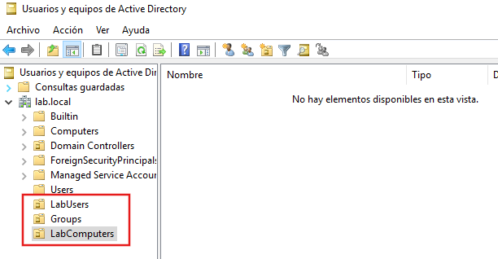
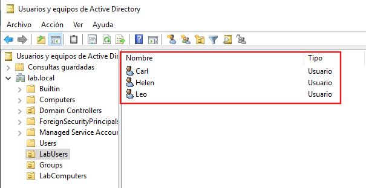
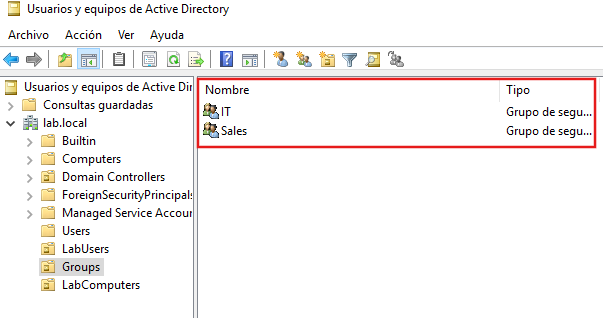
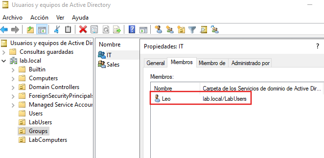
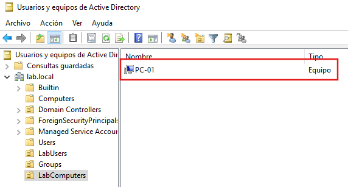
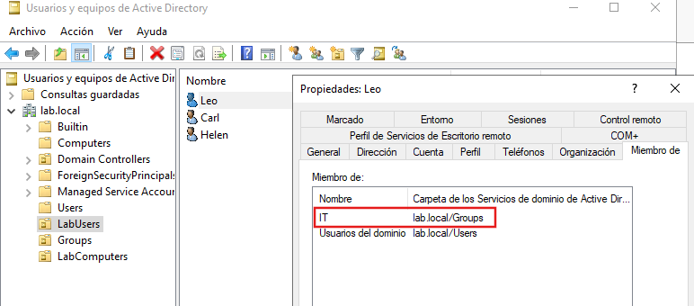

# Users and Groups

## Overview

This section documents the creation and management of Organizational Units (OUs), domain users and security groups in Active Directory.

Organizing users and computers into OUs simplifies administration and allows Group Policies to be applied more efficiently.

## Lab Objectives

- Create Organizational Units (OUs).
- Create domain user accounts.
- Create security groups.
- Assign users to security groups.
- Organize domain computers.

## Environment

| Component | Value |
|----------|-------|
| Server | SRV-DC01 |
| Operating System | Windows Server 2019 |
| Domain | `lab.local` |
| Management Tool | Active Directory Users and Computers |

## Creating Organizational Units

Three Organizational Units (OUs) were created to organize the Active Directory environment:

- LabUsers
- Groups
- LabComputers

This structure improves administration and makes it easier to apply Group Policies in larger environments.

## Creating Domain Users

Three domain user accounts were created inside the **LabUsers** Organizational Unit.

- Leo
- Carl
- Helen

These accounts can be used to authenticate to the domain and receive Group Policies.

## Creating Security Groups

Two Global Security Groups were created:

- IT
- Sales

Security groups simplify permission management by assigning permissions to groups instead of individual users.

## Assigning Group Membership

Users were added to their corresponding security groups.

This approach follows the recommended practice of managing permissions through groups rather than assigning permissions directly to users.

## Organizing Domain Computers

The client computer was moved into the **LabComputers** Organizational Unit.

Separating computers into dedicated OUs allows administrators to apply different Group Policies depending on the device type.

## Verifying User Membership

The user properties were reviewed to confirm that the account belongs to the expected security group.

## Results

The Active Directory environment was successfully organized using Organizational Units, domain users and security groups.

This structure provides a scalable foundation for centralized administration in future laboratories.

## Lessons Learned

- Create and organize Organizational Units.
- Manage domain user accounts.
- Create Global Security Groups.
- Assign users to security groups.
- Organize computers within Active Directory.
- Apply best practices for centralized administration.